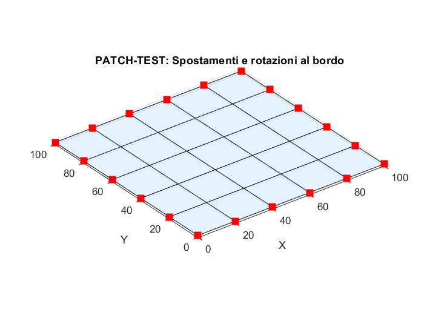
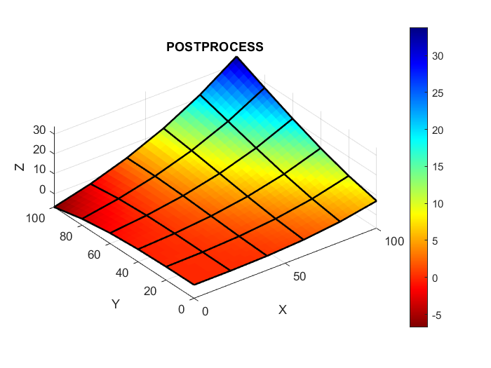

## flexEl — Kirchhoff Q4 Plate (Assumed Strains) for MATLAB

**flexEl** is a tiny MATLAB code for linear FEM, inspired by two assumed-strain formulations (a triangular membrane with drilling and a Kirchhoff plate). 

[Formulation of a new finite element based on assumed strains for membrane structures](https://link.springer.com/article/10.1007/s40091-019-00251-9)
[A Plate Bending Kirchhoff Element Based on Assumed Strain Functions](https://sanad.iau.ir/journal/jsm/Article/679586?jid=679586)
In this repository I’ve **basically implemented that idea** — but **only for the thin Kirchhoff Q4 plate**.

